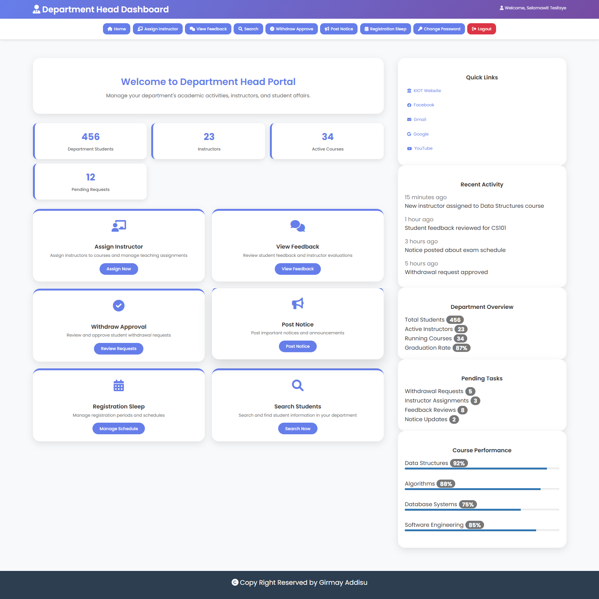

# Distance Education Management System - KIOT

A comprehensive web-based Distance Education Management System developed for Wollo University, Kombolcha Institute of Technology (KIOT). This system facilitates online education management with role-based access control for different user types.

## Features

### Multi-User Role System
- **Administrator**: Complete system management and user account control
- **Student**: Course materials, assignments, and academic tracking
- **Instructor**: Course content management and student assessment
- **Finance Officer**: Payment and financial record management
- **Registrar**: Student registration and academic record management
- **Faculty Registrar**: Faculty-level student registration oversight
- **Department Head**: Department-level academic and administrative control

### Core Functionalities
- User authentication and authorization
- Course material upload/download
- Assignment submission system
- Student feedback collection
- Email notifications (PHPMailer integration)
- Academic record management
- Payment tracking
- Notice board system

## Technology Stack
- **Backend**: PHP
- **Frontend**: HTML, CSS, JavaScript, Bootstrap
- **Database**: MySQL
- **Email**: PHPMailer
- **File Processing**: PHPExcel for spreadsheet operations

## Installation

1. Clone the repository
```bash
git clone https://github.com/girmiyadisu122542/KiotDistance.git
```

2. Set up database connection in `database.php`

3. Import database schema

4. Configure PHPMailer settings for email functionality

5. Deploy to web server with PHP support

## User Roles & Access

### Administrator Panel

- Create/manage user accounts
- Activate/deactivate users
- System-wide search functionality
- Password management

### Student Portal

- Download course materials and assignments
- Submit assignment answers
- View registration slips and course results
- Provide instructor feedback
- Request withdrawals

### Instructor Interface

- Upload course materials and assignments
- Download student submissions
- Register course results
- View student feedback
- Update course information

### Finance Officer Panel

- View payment records
- Financial tracking and reporting

### Registrar System

- Student information management
- Course registration
- Withdrawal approvals
- Department head assignments
- Bulk student upload via CSV

### Faculty Registrar Portal

- Faculty-level student registration
- Student information search

### Department Head Console

- Instructor assignments
- Student feedback review
- Withdrawal approvals
- Notice posting
- Registration schedule management

### Login System


### Landing Page


## Security Features
- Session-based authentication
- Role-based access control
- SQL injection protection
- Password validation patterns

## File Structure
```
├── login.php                 # Main authentication
├── administrator/            # Admin panel
├── student/                 # Student portal
├── Instructor/              # Instructor interface
├── financeofficer/          # Finance management
├── Registrial/              # Registrar system
├── facultyregistral/        # Faculty registrar
├── departementhead/         # Department head panel
├── css/                     # Stylesheets
├── js/                      # JavaScript files
└── image/                   # System images
```
